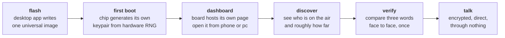
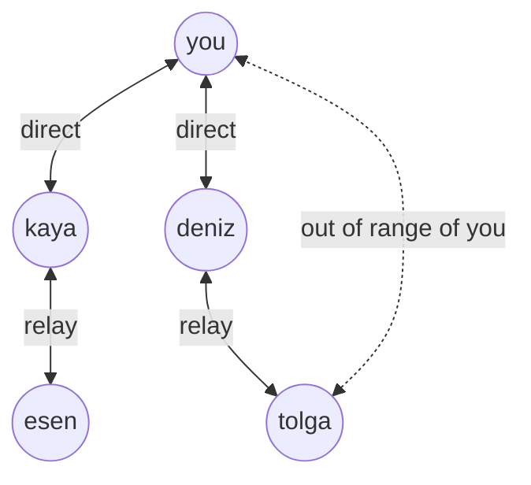
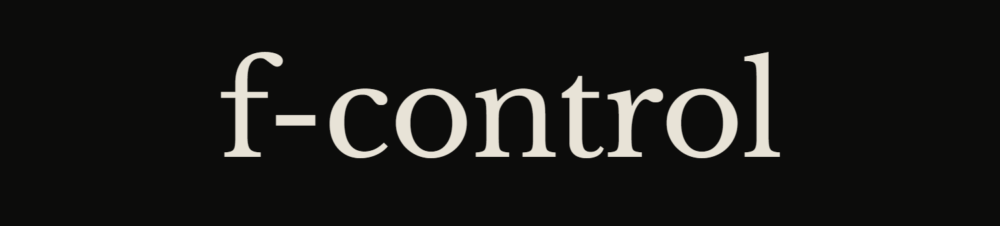

<p align="center">
  
</p>

<p align="center">
  
  
  
  
  
  
  
</p>

---

Chat Control assumes your messages pass through something a state can compel. A provider, a server, a gateway, a scanner bolted to the inside of your phone before the encryption starts.

f-control removes the assumption. There is no provider. There is no server. There is no account. Two ESP32 boards talk to each other directly over the air, the words are encrypted end to end with keys that were born on your device and have never left it, and nothing in the path belongs to anyone who can be served a warrant.

You need one four dollar board. That is the whole requirement.

> [!CAUTION]
> **`v0.1.0-dev` encrypts with one shared key per network, not the per-contact design described below.** Every board given the same network key can read every message on that network; nobody without it can. That is real protection against a stranger with a receiver. It is not private, per-person encryption: it does not say who sent a message, it does not stop one person on your network reading another's traffic, and nothing is signed, so anyone holding the key can claim to be anyone. The board says this on boot and the dashboard says it on every screen. Everything below this line describes where the project is going, including per-contact end to end encryption with signed identity. **Nothing below is true of `v0.1.0-dev` unless this warning says it is.**

> [!WARNING]
> Nothing here has been audited. Do not rely on it for anything that matters. This README is the design document, published early and in the open, because a privacy tool that gets designed in private is a privacy tool nobody should trust.

### v0.1.0-dev, what actually works today

Binaries and flashing instructions: [`release/v0.1.0-dev/`](release/v0.1.0-dev/RELEASE.md)

| | Status |
|---|---|
| Wire protocol codec | 93,057 host assertions passing under AddressSanitizer |
| Mesh relay, flood suppression | Tested to 100 simulated nodes, worst case 3 transmissions per packet |
| Shared-key message encryption | XChaCha20-Poly1305, 15 host assertions, vendored Monocypher, see below |
| ESP32 firmware, ESP-NOW radio, beacons | Runs on hardware, verified on an ESP32-D0WD-V3 |
| Board's own access point and dashboard | Runs on hardware, 44 KB gzipped, served from flash |
| Roster with signal-derived distance | Works |
| Messages between boards | Works, sealed under the network key |
| Delivery confirmation | Not implemented, no acknowledgements yet |
| Desktop flasher | Writes firmware, verified against a real board. Windows only so far |
| Flasher-time setup | Sets name, wifi network, and network key at flash time, over serial |
| **Per-contact end to end encryption, signed identity** | **Not implemented** |

Download [`f-control-v0.1.0-dev-windows.zip`](release/v0.1.0-dev/), extract it anywhere, run `f-control-flasher.exe`, plug in a board. Before writing, you can set the board's name, its wifi network name, a home network to join, and the network key that boards need in common to talk to each other; every field is optional and a network key is generated for you. Click **Write firmware** and it is all sent to the board right after, over the same USB connection. No installer, no dependencies. The firmware is compiled into the app, so nothing is downloaded and nothing sits on disk between the build and your board. It also runs headless with `--list`, `--flash COM3`, and `--monitor COM3`.

On macOS and Linux, use [esptool](https://github.com/espressif/esptool):

```
esptool.py --chip esp32 -p /dev/ttyUSB0 -b 460800 write_flash \
  --flash_mode dio --flash_size 4MB --flash_freq 40m \
  0x1000 bootloader.bin 0x8000 partition-table.bin 0x10000 f-control.bin
```

Then join the open network `f-control-XXXX` from a phone and open `http://192.168.4.1`. To watch both ends of a conversation you need two client devices, because each board runs its own access point and a phone can only join one at a time.

---

## What it is

A pocket-sized radio network for people who want to talk without being overheard by anything larger than the room they are in.

| | |
|---|---|
| **Hardware** | One bare ESP32. No radio module, no shield, no add-on. |
| **Range** | Roughly 200 to 500 metres line of sight per hop. Further through the mesh. |
| **Identity** | A keypair, generated on the chip, that never leaves the chip. |
| **Accounts** | None. There is nothing to sign up for and nothing to delete. |
| **Internet** | Not used. Not needed. Not permitted in the protocol. |
| **Cost** | The board. |

## Why

The EU's CSA Regulation, the thing everybody calls Chat Control, works by inserting an inspection point into a communication path. Every version of the proposal, however it is worded in a given month, needs the same two things to function: an identifiable service, and a place in the path where the plaintext exists.

f-control has neither. There is no service to designate as in scope. The plaintext exists on two devices, in two hands, and nowhere in between. A regulation aimed at intermediaries has nothing to bite when there is no intermediary.

This is not a legal argument. It is a physical one.

## How it works



### 1. Flash

Plug the board into a computer. Open the f-control desktop app. Click one button.

Everyone flashes the **same firmware image**. Nothing personal is compiled into it, nothing is baked in, nothing identifies the build as yours. The app verifies the image against a published SHA-256 before it writes a single byte.

### 2. First boot

The chip generates its own keypair using the hardware random number generator. An X25519 pair for key exchange, an Ed25519 pair for signing.

The private key is written to flash and never leaves it. Not to the desktop app, not to the dashboard, not over the air, not anywhere. The only way it moves is an encrypted backup you export deliberately with a passphrase you choose, so that losing the board does not mean losing the identity.

Your **public key fingerprint is who you are**, rendered as three plain words so a human can read them aloud:

```
horse amber nine
```

The username you pick is a label. It is cosmetic, it is spoofable, and the software treats it that way. The words are the truth.

### 3. Dashboard

The board hosts its own interface out of its own flash. Connect to the board's access point from a phone or a laptop and it is there. No app store, no install, no cloud.

If you would rather not switch networks every time, point the board at an existing wifi network from that same dashboard and it will serve itself there instead.

The whole interface is one gzipped file under 80 KB. Hand written HTML, CSS and JavaScript, system fonts, no framework, no CDN, no analytics, no outbound request of any kind. It cannot phone home because there is no code in it that knows how.

### 4. Discover

Nodes on the air appear in a list with a name, a fingerprint, and a rough distance derived from signal strength. Send a request. They accept. You talk.

Distance is **estimated from RSSI**, so it is honest about being approximate. The interface shows you a band and prints the raw dBm underneath. It will never draw you a precise number it does not have.

### 5. Talk

Messages are encrypted end to end and signed. The board holds the thread while the link is up. Download it to your own device whenever you want a copy, and when the link drops, what was on the board is gone.

The vocabulary is radio, not chat. A message is **heard** or **not heard**. Nothing is ever marked "read", because the network has no way to know that and will not pretend otherwise.

---

## The network



**ESP-NOW is the primary transport.** It is built into every ESP32, needs no access point, no association, no DHCP, no router. 250 byte frames, native broadcast, immediate.

**LoRa is an optional upgrade.** On boot the firmware probes SPI for an SX126x or SX127x. If one is there, it uses it and reaches kilometres instead of metres. If it is not, nothing is missing and nothing is disabled. The protocol above the radio is identical either way.

**The mesh carries what direct radio cannot.** Every packet has a hop count and a message ID from day one, so nodes out of your range are reachable through nodes that are in it, without loops and without duplicates.

## The protocol

| Layer | Choice | Why |
|---|---|---|
| Key exchange | X25519 | Fast on ESP32, no exotic dependencies |
| Signing | Ed25519 | Proves a message came from the key you verified |
| Content | XChaCha20-Poly1305 | Fast in software, so ESP32's hardware AES buys nothing on frames this small |
| Identity | Public key fingerprint, three words | Readable aloud by a human in a room |
| Trust | Verified in person, once | No directory, no authority, no server to lie to you |
| Framing | Hop count and message ID on every packet | Mesh from day one, not bolted on later |

### What `v0.1.0-dev` actually ships instead

The table above is the target: a per-contact key exchange, so encryption is between two verified people rather than shared by a group. `v0.1.0-dev` ships a smaller thing on the way there: **one XChaCha20-Poly1305 key, shared by every board on a network**, set as a passphrase when you flash. It uses the same cipher the target design settled on, vendored as [Monocypher](firmware/components/fcrypto/vendor/VENDOR.md), and it was chosen over rushing the real handshake, because a key exchange with signed identities built quickly is exactly how a privacy tool gets someone hurt. It is real protection against anyone outside the network, and it is not a substitute for the row above: nothing in it proves who sent a message, and anyone inside the network reads everything inside it.

### Verification, and the block that hides the words

An unverified fingerprint is drawn as a solid block. Censorship, rendered literally. It stays blocked until you meet the person and confirm the three words face to face, and then the block lifts and a thin gold rule appears under their name.

Gold means **verified by a human**. Red means **not confirmed**. Those two states are the only colour anywhere in the interface.

### Discovery, and what it costs you

By default a node beacons openly: name, fingerprint, and whatever your radio gives away about where you are. That is what makes the nearby list feel like magic, and it is the honest price of it. Anyone with a receiver in range can log that a named person was there at that time.

**Private mode** is a switch in the dashboard. It replaces the open beacon with a rotating tag only your existing contacts can recognise. Strangers see unlinkable noise, you lose the ability to discover new people, and you decide which of those two things you need today.

---

## Design

The interface is built like a pamphlet, not a product.

<table>
<tr><td><b>Ink</b></td><td><code>#0C0C0B</code></td><td>Warm near black. Never pure black.</td></tr>
<tr><td><b>Panel</b></td><td><code>#131210</code></td><td>One step up from ink.</td></tr>
<tr><td><b>Bone</b></td><td><code>#E8E3D7</code></td><td>Everything you read.</td></tr>
<tr><td><b>Gold</b></td><td><code>#C9A227</code></td><td>Verified by a human. Nothing else, ever.</td></tr>
<tr><td><b>Red</b></td><td><code>#C4241F</code></td><td>Not confirmed. Nothing else, ever.</td></tr>
</table>

**Libre Baskerville** for the wordmark and for the words people actually write to each other. **IBM Plex Mono** for every label, number and control. Two families, no third.

**Nearness is set in type.** The closest person on the roster is large, hard against the left margin, fully lit. Each node further away is smaller, indented deeper, and dimmer, until the faintest is a line of mono adrift on the right edge. You read the room as a gradient of presence before you read a single number. There are no signal bars. There is no radar. There are no coloured dots.

<p align="center"></p>

---

## What this does not protect you from

Every tool that claims total safety is lying, so here is the list.

> [!CAUTION]
> **The radio is public.** Content is encrypted. Presence is not. In the default open mode, anyone with a receiver can log that a named node was in range at a given time. Private mode fixes the name, not the fact that a transmission happened.

- **Traffic analysis.** When you transmit and how much you transmit is visible even when nothing readable is. Silence has meaning too.
- **Direction finding.** Radio can be triangulated with equipment that is neither rare nor expensive. This is true of every radio ever built.
- **Physical seizure.** The private key lives in the chip. If someone takes the board, they have the identity. Wipe it before it matters, not after.
- **The people you talk to.** End to end encryption ends at both ends. The other end is a person with a screen.
- **Short range.** A bare ESP32 covers hundreds of metres, not a city. The mesh helps only where there are nodes to relay through.
- **Bad crypto written by us.** Nothing here has been audited. Until it has been, assume it is broken and treat that assumption as the default state.

## Legal

Radio spectrum is regulated everywhere and the rules differ by country.

The 868 MHz band in the EU carries a **1% duty cycle limit** under ETSI EN 300 220, which in practice caps a LoRa node at roughly one message every ten seconds at the fastest spreading factor, and one every two minutes at the slowest. The firmware ships with a **region profile** for exactly this reason. Set it before you operate in the EU.

Some jurisdictions restrict encrypted transmission on amateur and unlicensed bands. Some restrict the hardware. Check your own rules. None of this is legal advice.

## Roadmap

- [ ] Protocol specification, written down before any firmware is written
- [ ] ESP-NOW transport and mesh framing
- [ ] Key generation, storage, and encrypted backup export
- [ ] On-device dashboard, under 80 KB gzipped
- [ ] Desktop flasher, Windows, macOS, Linux
- [ ] LoRa transport auto-detection
- [ ] Private mode beacons
- [ ] Forward secrecy and key rotation
- [ ] Independent security audit before anyone is told this is safe

## License

GPL-3.0 proposed, not yet decided. Copyleft, so that a tool built to resist enclosure cannot itself be enclosed.

---

<p align="center">
  <sub>f-control, by Seventh. Built because the alternative is asking permission.</sub>
</p>
