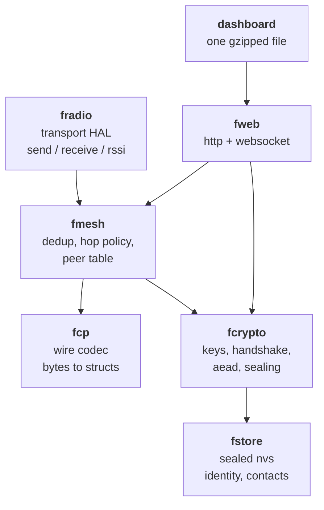
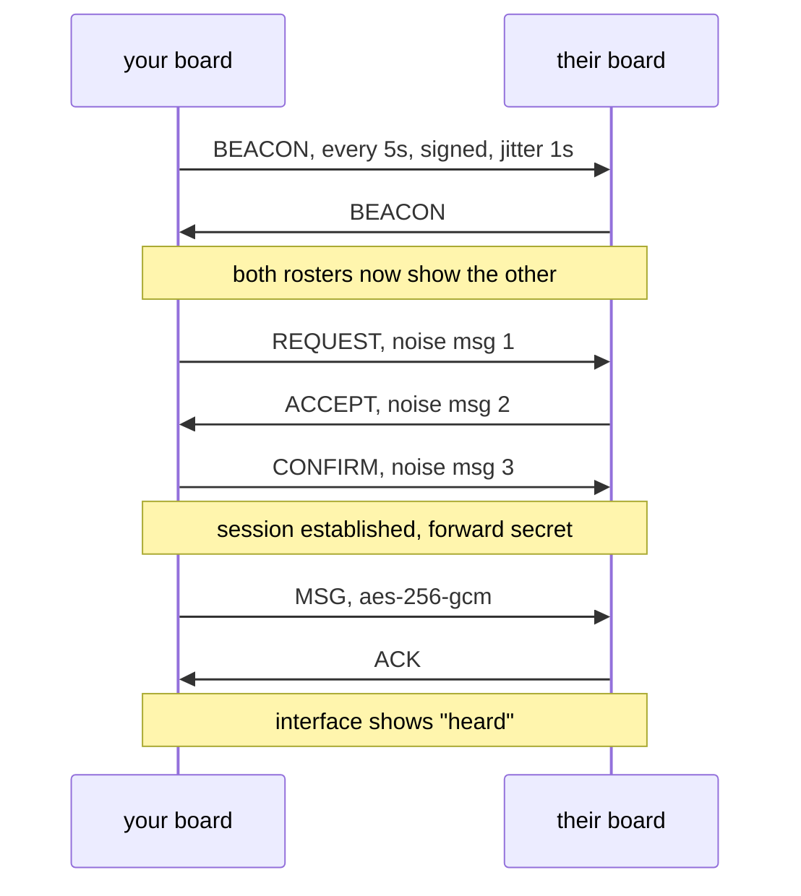

# f-control v0.1 design spec

Date: 2026-07-29
Status: proposed, awaiting approval
Scope: everything needed to build and ship v0.1

---

## 1. What v0.1 is

Two or more bare ESP32 boards that find each other over the air and exchange end to end encrypted messages, with no internet, no server, and no account. Each board hosts its own interface. A desktop app puts the firmware on the board.

A person with one four dollar board and no technical knowledge can flash it, unlock it, see who is nearby, verify one of them in person, and hold a conversation.

### In scope

| Area | v0.1 |
|---|---|
| Hardware | ESP32, ESP32-S3, ESP32-C3. No radio add-on. |
| Transport | ESP-NOW only, mesh rendezvous on channel 1 |
| Home network | Station mode, marked beta, see section 3.3 |
| Topology | Direct plus flood relay, hop limit 3 |
| Crypto | Noise XX handshake, per session forward secrecy, AES-256-GCM |
| Identity | Keypair generated on chip, sealed in flash behind a passphrase |
| Discovery | Open beacons, signed, one relay hop |
| Interface | Dashboard served from the board's own access point |
| History | RAM only, never written to flash, downloadable |
| Flasher | Tauri desktop app, Windows build |

### Cut from v0.1, with reasons

These are real cuts, not oversights. Each is listed so the decision is visible rather than discovered later.

| Cut | Why | Returns in |
|---|---|---|
| **LoRa transport** | The radio HAL boundary exists from day one so this is an addition, not a rewrite. But no LoRa hardware means no way to test it honestly. | v0.2 |
| **Private mode beacons** | Requires a contact-recognisable rotating tag scheme that is worth designing on its own. The toggle's absence does not change the default behaviour, which is open beacons. | v0.2 |
| **Messages over 180 bytes** | Fragmentation and reassembly across a lossy flood mesh is its own problem. The composer enforces the limit and shows the budget. | v0.2 |
| **macOS and Linux flasher builds** | Tauri needs a machine per target and code signing per platform. The Windows build unblocks the actual testing. | v0.1.1 |

---

## 2. Architecture

Seven components. Each has one job, a defined interface, and can be understood without reading the others.



| Component | Job | Depends on | Host testable |
|---|---|---|---|
| `fcp` | Encode and decode wire packets. No I/O, no crypto, no allocation. | nothing | yes, fully |
| `fcrypto` | Key generation, Noise handshake, AEAD, sealing flash at rest | mbedtls | yes, fully |
| `fmesh` | Deduplication, hop limit, rebroadcast timing, peer table, session table | `fcp`, `fcrypto` | yes, with a simulated channel |
| `fradio` | Transport abstraction. One implementation in v0.1. | ESP-IDF esp_now | no, but the interface is mockable |
| `fstore` | Read and write sealed identity, contacts, settings in NVS | `fcrypto`, ESP-IDF nvs | no |
| `fweb` | HTTP server and WebSocket bridge between the UI and the core | `fmesh`, `fcrypto` | no |
| `dashboard` | The interface. Built separately, gzipped, embedded as a binary blob. | nothing | yes, in a browser |

**Build system is ESP-IDF, not Arduino.** We need control over partition layout, NVS encryption, RAM budgets, and the ability to compile `fcp`, `fcrypto` and `fmesh` natively for host tests. Arduino hides all four.

**The boundary that matters most is `fradio`.** It exposes exactly three things: `send(dst_id, bytes, len)`, an `on_receive(bytes, len, rssi)` callback, and `max_payload()`. Nothing above it knows what a wifi channel is. That is what makes LoRa an addition in v0.2 rather than a rewrite.

---

## 3. Decisions on the four open questions

### 3.1 The wire format

Protocol name is **FCP**, version 1. All integers little endian. Maximum frame is 250 bytes, set by ESP-NOW.

**Common header, 16 bytes, on every packet:**

| Offset | Size | Field | Notes |
|---|---|---|---|
| 0 | 1 | `magic` | `0xFC` |
| 1 | 1 | `version` | `0x01` |
| 2 | 1 | `type` | see table below |
| 3 | 1 | `flags` | bit 0 set means `dst_id` is present |
| 4 | 4 | `msg_id` | random per packet, from hardware RNG |
| 8 | 1 | `hop_limit` | decremented on each relay, packet dropped at 0 |
| 9 | 1 | `hop_count` | incremented on each relay, shown in the interface |
| 10 | 6 | `src_id` | first 6 bytes of SHA-256 of the sender's Ed25519 public key |

When `flags` bit 0 is set, a 6 byte `dst_id` follows the header, making it 22 bytes.

**`hop_limit` and `hop_count` are mutable in flight and are therefore never covered by any signature.** Anything that signs a packet signs `version`, `type`, `src_id` and the payload, and nothing else. A signature over a field a relay is required to change would fail at the first hop.

| Type | Name | Addressed | Hop limit | Payload |
|---|---|---|---|---|
| `0x01` | `BEACON` | no | 1 | 155 bytes |
| `0x02` | `REQUEST` | yes | 3 | Noise message 1 |
| `0x03` | `ACCEPT` | yes | 3 | Noise message 2 |
| `0x04` | `CONFIRM` | yes | 3 | Noise message 3 |
| `0x05` | `MSG` | yes | 3 | 12 byte nonce, ciphertext, 16 byte tag |
| `0x06` | `ACK` | yes | 3 | 4 byte `msg_id` being acknowledged |

**BEACON payload, 155 bytes:**

```
ed25519_pub    32   identity, signing
x25519_pub     32   static key, used by Noise XX
name_len        1   0 to 20
name           20   utf-8, zero padded, cosmetic only
boot_id         2   random at every boot, from the hardware RNG
seq             4   increments per beacon within one boot
signature      64   ed25519 over version, type, src_id and all preceding payload bytes
```

Total on air: 16 header plus 155 equals **171 bytes**.

`boot_id` exists because `seq` resets to zero when a board reboots. Without it, a peer that remembers a high `seq` would reject every beacon from a freshly restarted neighbour as a replay, and the node would silently never reappear in the roster. Receivers track `(boot_id, seq)` per contact, and a changed `boot_id` resets the expected sequence.

**MSG payload budget:** 250 total, minus 22 header with destination, minus 12 nonce, minus 16 tag, leaves **200 bytes**. We cap plaintext at **180 bytes** and reserve 20 for protocol growth without a version bump.

> The mockup composer currently reads `48 / 250 bytes`. It must read `48 / 180 bytes`. The number in the interface is the real budget or it is a lie.

**Handshake is Noise XX**, pattern `Noise_XX_25519_AESGCM_SHA256`, carried across `REQUEST`, `ACCEPT` and `CONFIRM`.

We are not designing our own handshake. The README promises that nothing here is safe until it is audited, and the fastest way to guarantee it never passes an audit is a bespoke key exchange. Noise XX gives us mutual authentication, identity hiding until the third message, and per session forward secrecy from ephemeral keys, all from a specification that already has test vectors. If the vendored implementation will not fit the flash budget, the fallback is a documented SIGMA style signed ephemeral exchange, and that fallback must be recorded in the spec before it is written, not after.

### 3.2 Mesh behaviour under contention

ESP-NOW is a single shared channel. Naive flooding collapses at a handful of active nodes.

**Rebroadcast policy: counter based flooding with random assessment delay.**

Deduplication uses two mechanisms, because one cache cannot serve both kinds of traffic.

- **Beacons** are deduplicated by `(boot_id, seq)` held in the peer table, one entry per contact. They never touch the ring.
- **Addressed traffic** is deduplicated by `(src_id, msg_id)` in a ring cache.

Sizing the ring matters. At the 50 node design target, beacons alone would be 10 packets per second, and a 64 entry ring with a 60 second time to live would hold only about 6 seconds of them before wrapping, so entries would age out early and the same packet would be relayed twice. Keeping beacons out of the ring removes that load entirely, and the ring is sized at **128 entries** for conversation traffic, which is roughly 4 minutes of a busy cell.

1. Packet arrives. If it is a duplicate by the mechanism for its type, drop it and stop.
2. Record it. The ring is 128 entries with a 60 second time to live.
3. If `hop_limit` is 0, or the packet is addressed to us, do not relay.
4. Otherwise wait a random 20 to 120 ms.
5. During that wait, if we hear the same `(src_id, msg_id)` rebroadcast by anyone else, cancel. Someone closer already did it.
6. Otherwise decrement `hop_limit`, increment `hop_count`, and send.

Step 5 is what stops the storm. In a dense cluster only one or two nodes actually rebroadcast, because everyone else hears it happen during their own delay window and stands down.

**Airtime budget.** ESP-NOW frames at the 1 Mbit basic rate cost roughly 2 ms including overhead. A 169 byte beacon every 5 seconds with one relay hop is 2 transmissions per node per interval.

| Nodes in range | Channel occupancy from beacons |
|---|---|
| 10 | 0.8% |
| 25 | 2.0% |
| 50 | 4.0% |
| 100 | 8.0% |

Beacons are affordable. Conversation traffic sits on top and is bursty, so the design target is **50 nodes in one radio cell**, and the interface shows a warning above that.

**Beacons relay exactly one hop.** This is why the roster can show a node at "2 hops" while remaining honest: you are seeing someone your neighbour can hear. Relaying beacons further would let the roster fill with people you have no path to.

**Sequence numbers.** A beacon whose `seq` is not greater than the last one seen from that `src_id` is dropped, which kills replay of a captured beacon.

### 3.3 The ESP-NOW and wifi channel conflict

This is the failure that would make the product feel broken, so it gets a decision rather than a workaround.

An ESP32 has one radio. ESP-NOW transmits on whatever channel that radio is on. If the board joins a home wifi network on channel 6, ESP-NOW moves to channel 6 with it. Two boards on two different home networks land on two different channels and become invisible to each other, with no error, no warning, and nothing in the interface to explain it. The user concludes the product does not work.

**Decision: the mesh has a fixed rendezvous channel, channel 1. Access point mode parks there permanently. Station mode reaches it on a duty cycle and is marked beta in the interface.**

#### Access point mode, the default

The radio sits on channel 1 and never moves. Full range, full speed, no compromise. This is what the interface recommends and what the flasher sets up.

#### Station mode, beta

The board joins a network you already have, and the dashboard becomes reachable from that network instead of from the board's own access point.

There are two cases, and the board detects which one it is in.

**Case one, the home network is already on channel 1.** Nothing to reconcile. The mesh and the network share a channel, performance is identical to access point mode, and the interface says so.

**Case two, the home network is on any other channel.** The board time-slices:

| Phase | Duration | What happens |
|---|---|---|
| Home window | 1700 ms | Parked on the home channel. Dashboard is responsive. Outbound mesh packets queue. |
| Mesh window | 300 ms | Hopped to channel 1. Beacons go out, the queue flushes, inbound traffic is heard. |

Before each excursion the board sends a null data frame to its access point with the power save bit set, so the access point buffers for it rather than treating it as gone. On return the bit is cleared and buffered frames drain.

The honest consequences, all of which the interface states plainly:

- The board is deaf to the mesh for 85% of every cycle. A sender needs more attempts to land a message.
- Delivery latency grows by up to one full cycle, so roughly 2 seconds per hop.
- Relaying is disabled while in this mode. A board that is only listening 15% of the time is a bad relay, and a bad relay poisons other people's paths.
- Discovery still works, because beacons repeat and the window is hit within a few cycles.

**Why this is beta and labelled as such.** It depends on an access point honouring power save buffering, which most do and some do not, and the failure mode on a badly behaved access point is a stuttering dashboard rather than anything dangerous. It ships with a persistent banner in the dashboard naming the mode, the cost, and the one line fix: set the router to channel 1, or use access point mode.

**Access point details.** SSID is `f-control-` plus the last four hex characters of the fingerprint. WPA2 with a 12 character password generated from the hardware RNG at first boot, shown once by the flasher and recoverable over serial. Not an open access point, because an open one puts the dashboard in reach of anyone in the car park.

### 3.4 Retention, and what "link lost" means

**Message content is never written to flash. Not once, not ever, not as a cache.**

Messages live in a per peer RAM ring buffer of 16 KB, roughly 90 messages, oldest evicted first. This gives a property worth stating plainly: a board that is powered off contains no messages, so seizing it recovers nothing but the sealed identity.

Content is cleared when any of these happen:

1. Power loss or reboot. RAM is volatile, so this needs no code.
2. The peer has not been heard for 15 minutes. The session key is zeroed and the buffer is cleared.
3. The user presses **Wipe now**, which zeroes every buffer and every session key immediately.

**Download** serializes a thread to a plain text file on the user's own device. That is the only durable copy, it lives on their hardware, and the responsibility for it is theirs.

**What is in flash,** sealed:

| Item | Notes |
|---|---|
| Ed25519 and X25519 private keys | Generated at first boot from the hardware RNG |
| Username | Cosmetic |
| Contacts | Public key, name, verified flag, first seen timestamp |
| Settings | Access point password, region profile |

Sealed with AES-256-GCM under a key derived from the user's passphrase by PBKDF2-HMAC-SHA256, 600,000 iterations. Argon2id is the better function and it is too heavy for this chip, so the parameter choice is documented rather than hidden. ESP32 hardware flash encryption via eFuse is available as optional hardening for anyone who wants it and accepts that it is irreversible.

**Consequence: the board requires the passphrase at boot.** It does not beacon, does not accept sessions, and does nothing but serve an unlock page until the passphrase is entered. This is friction, and it is the correct friction for a threat model that includes someone picking the board up off a table.

---

## 4. Data flow



**Verification is out of band and happens once.** Both people read three words aloud in the same room and press confirm. The contact's verified flag is written to flash. Until then the fingerprint renders as a solid block and the name carries no gold rule.

**Distance** is derived from RSSI, mapped to four coarse bands, with the raw dBm printed underneath. The bands are calibrated once against a known distance during testing and the calibration is documented as approximate.

| RSSI | Band |
|---|---|
| above -60 dBm | near |
| -60 to -75 | tens of metres |
| -75 to -90 | hundreds of metres |
| below -90 | far |

---

## 5. Error handling

Every one of these is a state the interface must be able to show. None of them is allowed to be a silent failure.

| Condition | Behaviour |
|---|---|
| Send fails at the radio | Retry 3 times with 50, 150, 400 ms backoff, then mark the message **not heard** in red |
| Send fails, station mode on a non channel 1 network | Retry 3 times at 2200 ms spacing so each attempt lands in a mesh window, then mark **not heard**. The 50, 150, 400 ms ladder would spend all three attempts inside one home window and fail every time |
| No ACK within 8 seconds | Mark **not heard**. Do not auto retry, the user decides. In station mode the timeout is 14 seconds, because two full cycles of latency is normal rather than a failure |
| Malformed or truncated packet | Drop silently, increment a counter visible in diagnostics. Never respond, never log the sender |
| Unknown `version` | Drop. Show "a nearby node is running a newer f-control" once per hour |
| MSG arrives with no session | Drop silently. Do not reply, because a reply is an oracle telling a prober which node has which sessions |
| Signature check fails on a beacon | Drop, increment counter. The node does not appear in the roster |
| Beacon `seq` not greater than last | Drop as a replay |
| Contact storage full, 64 entries | Refuse the new contact with a plain message naming which contact to remove |
| Wrong passphrase | Constant time compare. After 3 attempts, 30 second lockout, doubling to a 30 minute cap |
| Dedup cache overflow | Oldest entry evicted. This is normal, not an error |
| More than 50 nodes in range | Banner in the roster stating the mesh is above its tested density |

---

## 6. Testing

**Host tests, run on every commit.** `fcp`, `fcrypto` and `fmesh` compile natively and are tested without hardware.

| Target | Tests |
|---|---|
| `fcp` | Encode and decode round trip for all six types. Truncated input at every byte offset. Oversized payload. Bad magic. Bad version. Fuzzing over random bytes, with the pass condition being that nothing crashes and nothing reads out of bounds |
| `fcrypto` | Noise XX official test vectors. Sealing round trip. Wrong passphrase fails. Nonce never repeats within a session |
| `fmesh` | Simulated channel with N nodes and injectable packet loss. Assert dedup blocks duplicates, hop limit terminates, the assessment delay suppresses storms, and a 3 hop chain delivers |

**Density simulation.** The `fmesh` harness runs 10, 25, 50 and 100 virtual nodes and asserts that rebroadcasts per packet stay below 3 at every density. This is the test that proves the flood does not collapse.

**On device, manual, documented as a checklist.** Two boards, then four. Range measured outdoors and recorded. A 24 hour soak asserting no heap growth and no reboot.

**Dashboard.** Gzipped size is asserted in CI. Over 80 KB fails the build.

---

## 7. Repository layout

```
firmware/
  main/                     entry, boot, unlock flow
  components/fcp/           wire codec, host testable
  components/fcrypto/       keys, noise, aead, sealing
  components/fmesh/         dedup, relay, peer and session tables
  components/fradio/        transport hal, esp-now implementation
  components/fstore/        sealed nvs
  components/fweb/          http and websocket
  test/host/                native test runner
dashboard/
  src/                      the interface, hand written
  build/                    gzipped output embedded into firmware
flasher/
  src-tauri/                rust, espflash
  src/                      flasher ui
docs/
  spec/fcp-v1.md            wire format, extracted from this document
  superpowers/specs/        design specs
```

---

## 8. Interface changes this spec forces

Three corrections to the approved mockups. The design is unchanged, the numbers were provisional.

1. The composer reads `48 / 180 bytes`, not 250.
2. The roster needs an **unlock screen** before it, which the mockups do not have. Wordmark, passphrase field, one button, nothing else.
3. The roster needs a **density warning** state and an **above 64 contacts** state.
4. Station mode needs a **persistent beta banner** naming the mode, the cost, and the fix, plus a settings screen for joining a network.

---

## 9. Definition of done for v0.1

- [ ] Two boards flashed from the Windows app find each other and show correct distance bands
- [ ] A third board out of range of the first is reachable through the second, showing 2 hops
- [ ] A message is delivered, acknowledged, and shown as heard
- [ ] A message with no path is shown as not heard, in red, within 8 seconds
- [ ] Verification lifts the redaction block and draws the gold rule, and it survives reboot
- [ ] Reboot loses all messages and keeps the identity
- [ ] Wrong passphrase locks out, correct passphrase unlocks
- [ ] Dashboard is under 80 KB gzipped and makes zero outbound requests
- [ ] Host test suite passes, including the 100 node density simulation
- [ ] 24 hour soak with no heap growth and no reboot
- [ ] Station mode joins a network on channel 1 and performs identically to access point mode
- [ ] Station mode joins a network on channel 6, still discovers and delivers, shows the beta banner, and does not relay
- [ ] A board that drops off its home network falls back to access point mode without losing its identity
